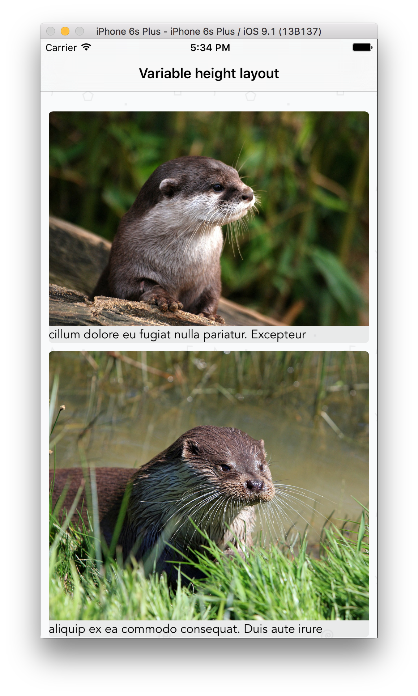
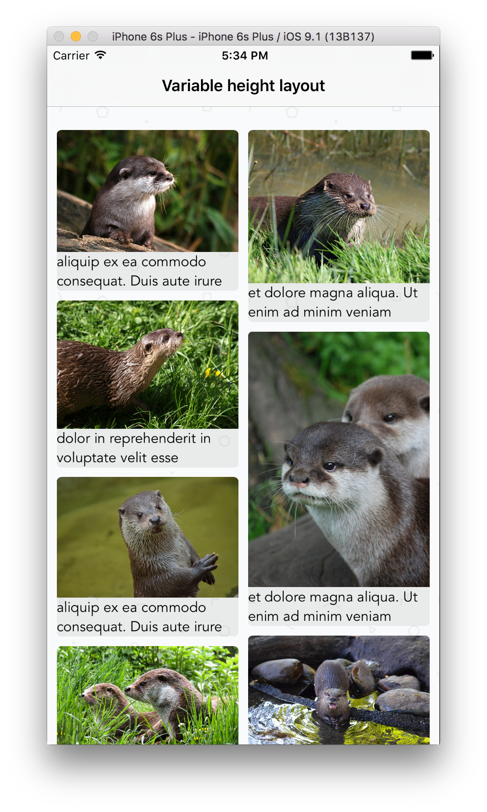
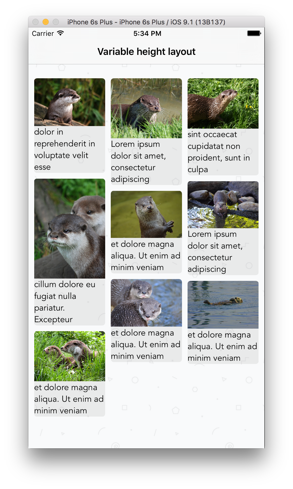
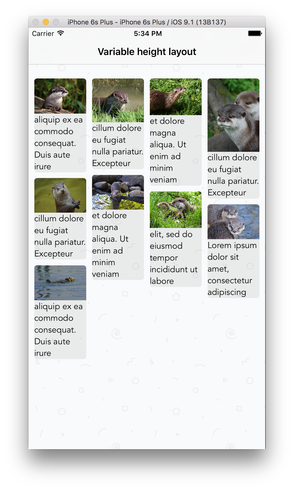

# UIStackView Photo Collage

A multiple-column photo collage implemented using `UIStackView`, `UICollectionView`, and a custom `UICollectionViewLayout` subclass.

### Uses

Implement your own dynamic `UICollectionView` backed photo collage with caption support. 

## Getting started

1. Drag the **ColumnViewLayout** folder into your project in XCode

2. Initialize a UICollectionView with the `MultipleColumnLayout` layout.

3. Customize your layout as follows

```Swift
let multiColumnLayout = MultipleColumnLayout()

multiColumnLayout.cellPadding = 5
multiColumnLayout.delegate = self
multiColumnLayout.numberOfColumns = 2

let myCollectionView = UICollectionView(frame: CGRectZero, collectionViewLayout: multiColumnLayout)
```

Screenshots
---------




