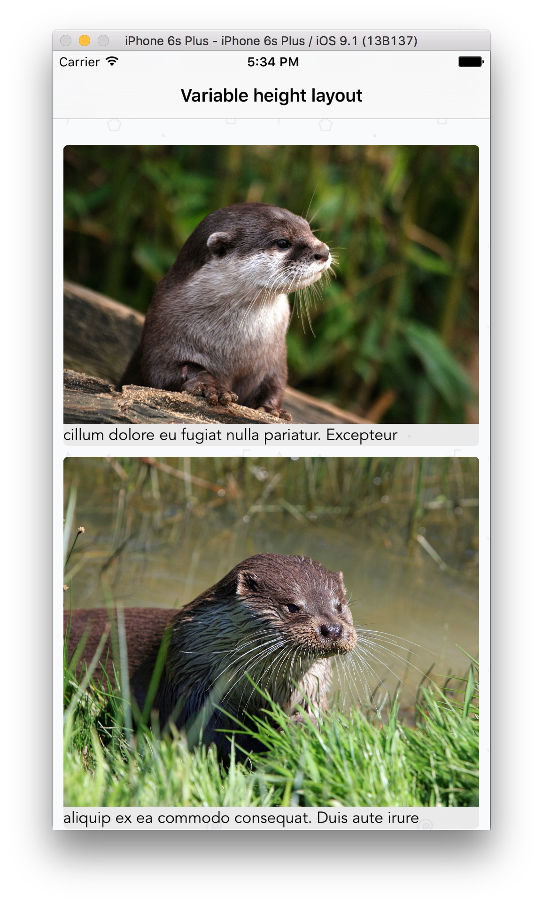
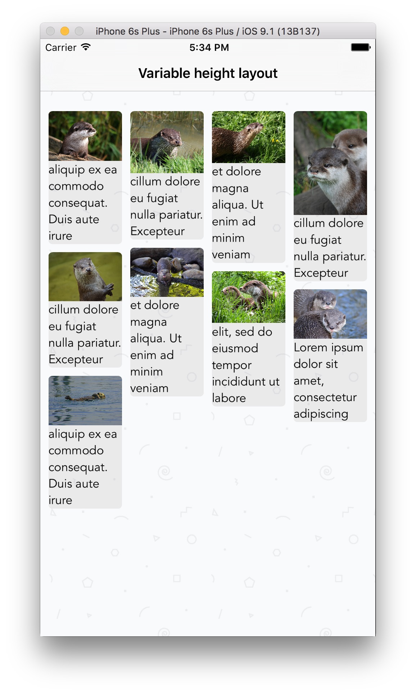

# UIStackView Photo Collage

Render photos and captions beautifully using `UIStackView` and `UICollectionView`. Includes built-in support for multiple columns (via a property setter) and multi-line captions. 

Compatible with iOS 9+ and the most recent Swift release (Swift 2.1).

**StackViewPhotoCollage** is implemented using `UIStackView`, `UICollectionView`, and a custom `UICollectionViewLayout` subclass.

### Getting started

1. Clone this project
2. Drag the **StackViewPhotoCollage/StackViewPhotoCollage** folder into your project in XCode
3. Initialize a `UICollectionView` with the `MultipleColumnLayout` layout
4. Conform to `MultipleColumnLayoutDelegate` protocol on your `UICollectionView` data source (or another class) by implementing the following:

    ```Swift
    protocol MultipleColumnLayoutDelegate: class {
        func collectionView(collectionView: UICollectionView, heightForPhotoAtIndexPath indexPath: NSIndexPath, withWidth width: CGFloat) -> CGFloat
        func collectionView(collectionView: UICollectionView, heightForAnnotationAtIndexPath indexPath: NSIndexPath, withWidth width: CGFloat) -> CGFloat
    }
    ```

5. Customize your `MultipleColumnLayout` layout instance as follows before adding it to your `UICollectionView`

    ```Swift
    let multiColumnLayout = MultipleColumnLayout()
    
    multiColumnLayout.cellPadding = 5
    multiColumnLayout.delegate = myDelegate // your UICollectionViewDataSource might be a good fit
    multiColumnLayout.numberOfColumns = 2
    
    let myCollectionView = UICollectionView(frame: CGRectZero, collectionViewLayout: multiColumnLayout)
    ```


### Screenshots

#### One column


#### Two columns


#### Three columns


#### Four columns


### Credits

Thank you Ray Wenderlich for the custom UICollectionView video tutorials, which were an inspiration for this project.

### License

The MIT License (MIT)

Copyright (c) Giancarlo Daniele
